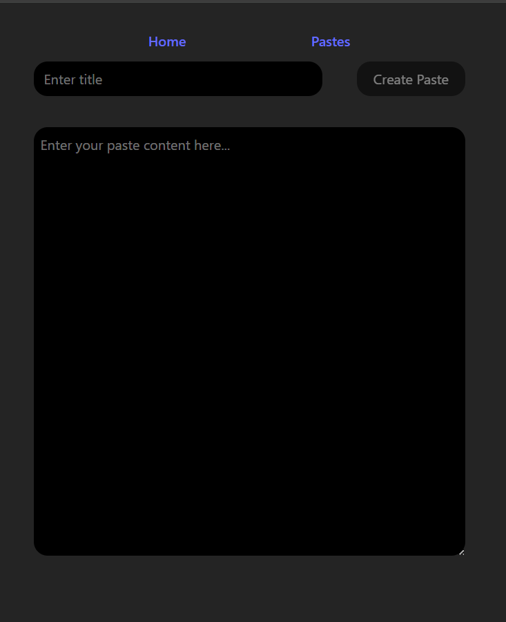
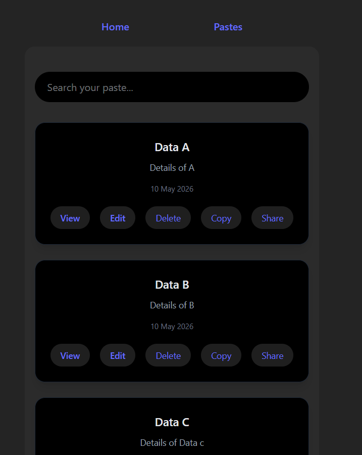
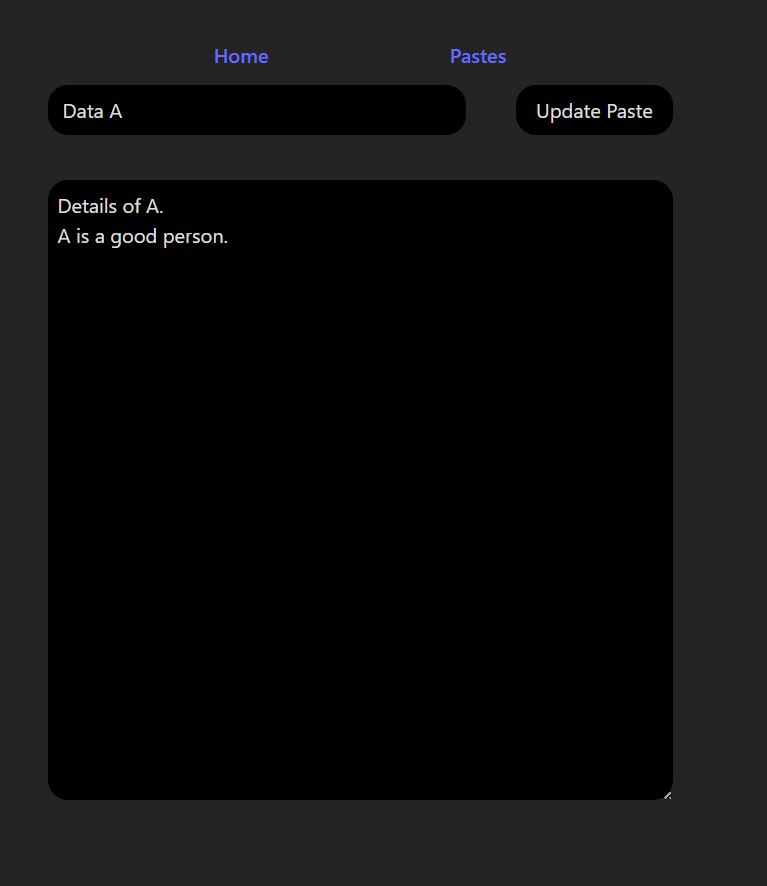
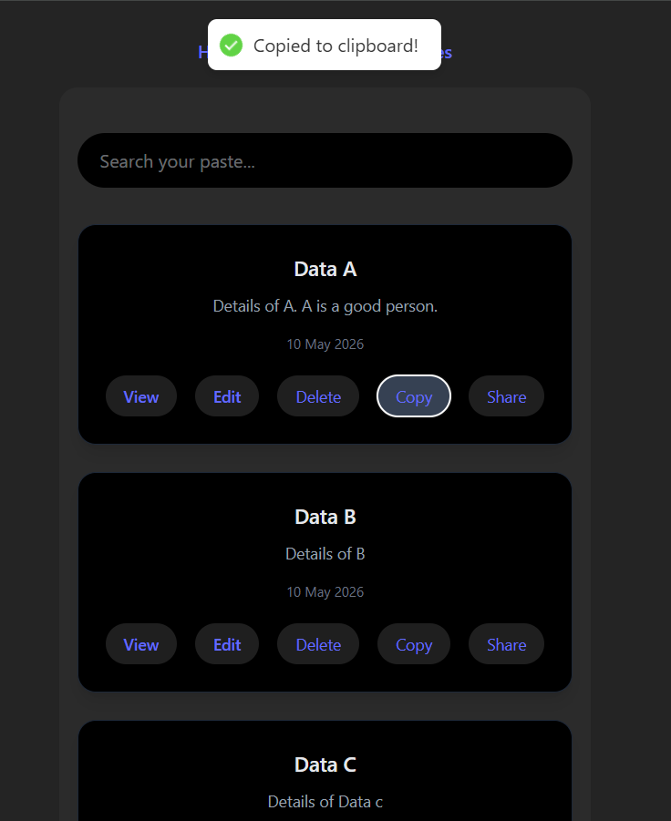
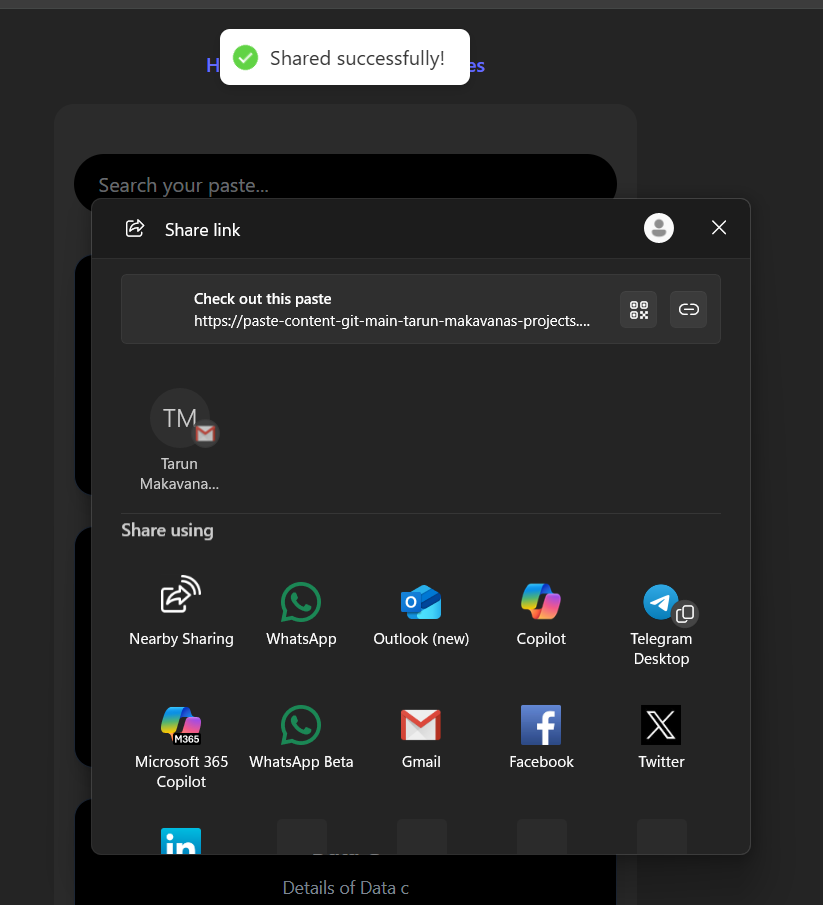

````md
# PasteContent – React Text & Code Snippet Sharing App

PasteContent is a modern and responsive React.js application that allows users to create, save, manage, and share text or code snippets using unique URLs. The project focuses on clean UI design, fast user interactions, reusable React components, and efficient state management using Redux Toolkit.

The application is designed to simulate a lightweight paste-sharing platform similar to Pastebin, with additional modern UI improvements and smooth user experience.

---

# 🚀 Live Demo

🔗 https://paste-content-git-main-tarun-makavanas-projects.vercel.app/

---

# 📸 Application Preview

## 🏠 Create Paste Page



---

## 📚 All Pastes Dashboard



---

## ✏️ Edit Paste Feature



---

## 📋 Copy to Clipboard Feature



---

## 🔗 Share Paste Feature



---

# ✨ Features

- 📋 Create and save text/code snippets instantly
- 🔗 Generate unique links for each paste
- ✏️ Edit existing pastes
- 🗑️ Delete saved pastes
- 📄 View individual paste pages
- 📋 One-click copy to clipboard
- 🔍 Search saved pastes instantly
- 📱 Fully responsive user interface
- ⚡ Fast navigation using React Router
- 🧠 Centralized state management using Redux Toolkit
- 🎨 Clean dark-themed modern UI
- 🌐 Easy deployment using Vercel

---

# 🛠️ Tech Stack

## Frontend
- React.js
- Vite
- Tailwind CSS

## Routing
- React Router DOM

## State Management
- Redux Toolkit
- React Redux

## Deployment
- Vercel

---

# 📂 Project Structure

```bash
src/
│
├── components/
│   ├── Navbar.jsx
│   ├── Home.jsx
│   ├── Pastes.jsx
│   └── ViewPaste.jsx
│
├── redux/
│   ├── store.js
│   └── pasteSlice.js
│
├── App.jsx
├── main.jsx
└── index.css
```

---

# ⚙️ Core Functionalities

## 🏠 Home Page
- Create new pastes
- Update existing pastes
- Dynamic Create/Update button rendering
- Controlled textarea handling using React Hooks

## 📚 Pastes Dashboard
- Display all saved pastes
- Search functionality using filtering
- Edit/View/Delete/Copy/Share actions
- Dynamic rendering of paste cards

## 👁️ View Paste Page
- Open specific paste using unique ID
- Read-only paste viewer
- Shareable URL support

---

# 🧠 Technical Highlights

## React Hooks
Used:
- `useState`
- `useEffect`

for:
- form handling
- dynamic rendering
- filtering logic
- UI updates

---

## Redux Toolkit
Redux Toolkit is used for centralized state management.

Implemented:
- Global paste storage
- Add paste functionality
- Update paste functionality
- Delete paste functionality
- Optimized reducer handling

---

## Dynamic Routing
Implemented using `react-router-dom`

Routes:

```bash
/               -> Home Page
/pastes         -> All Pastes
/pastes/:id     -> View Specific Paste
```

---

## Clipboard API
Used browser clipboard API for quick copy functionality.

---

## Share API
Integrated native browser sharing functionality for easy paste sharing.

---

# 🌐 Deployment

This project is deployed using Vercel.

## Deployment Steps

1. Push project to GitHub
2. Import repository into Vercel
3. Deploy instantly

---

# 📈 Future Improvements

- 🔐 User Authentication
- ☁️ Backend Database Integration
- 🌈 Syntax Highlighting for Code
- 📥 Download Paste Feature
- 🌍 Public/Private Paste Visibility
- ❤️ Favorite Pastes
- 📊 Analytics Dashboard
- 📝 Markdown Support

---

# 👨‍💻 Learning Outcomes

This project helped in understanding:
- Component-based architecture
- Redux Toolkit workflow
- React Router navigation
- State management patterns
- Clipboard & Share APIs
- CRUD operations in React
- Responsive UI development
- Modern frontend project structure

---

# 📦 Packages Used

```bash
npm install react-router-dom
npm install @reduxjs/toolkit react-redux
```

---

# 🖥️ Screenshots Folder Structure

```bash
screenshots/
│
├── home.png
├── pastes.png
├── edit.png
├── copy.png
└── share.png
```

---

# 👤 Author

**Tarun Makavana**

- GitHub:(https://github.com/tarun0001g)
- LinkedIn: www.linkedin.com/in/tarun-makavana-52601427a

---

# ⭐ Support

If you liked this project, consider giving it a ⭐ on GitHub.
````
